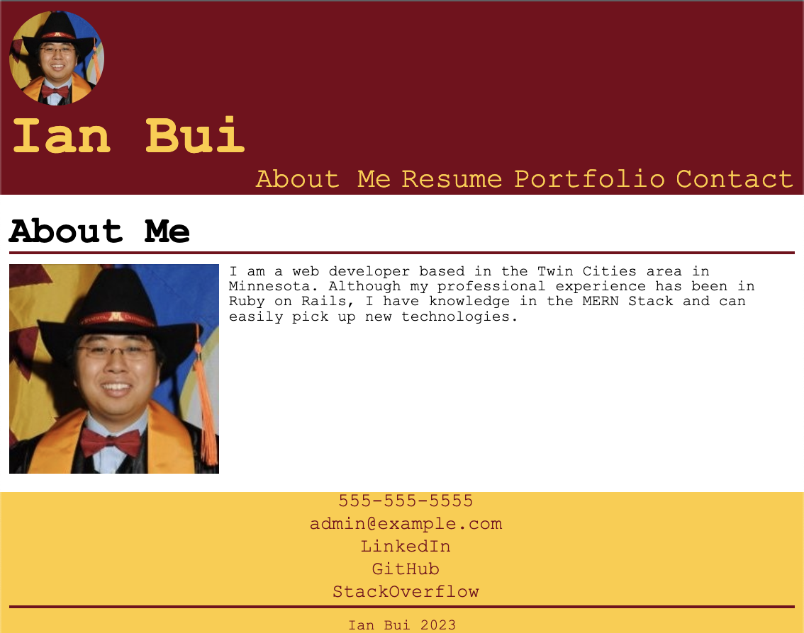

# umn-edx-react-portfolio

## SUMMARY
This is a professional portfolio website mean to showcase my software development abilities.  It is built using ReactJS and is a significant upgrade over the [strictly HTML/CSS portfolio](https://github.com/thinkbui/umn-edx-professional-portfolio) created several weeks prior.

## NOTES
One of the requirements is to have a direct link to the live application for each project, but the old portfolio was designed to only offer links to each project's repository where there is a link to the live application.  It is still my intention to have employers go through the repos, so to satisfy this requirement, the new links (visible as '🚀 Deployed App') are intentionally made small.

## LIVE VIEW
You can view the live app on [Heroku](https://thinkbui.herokuapp.com/).

